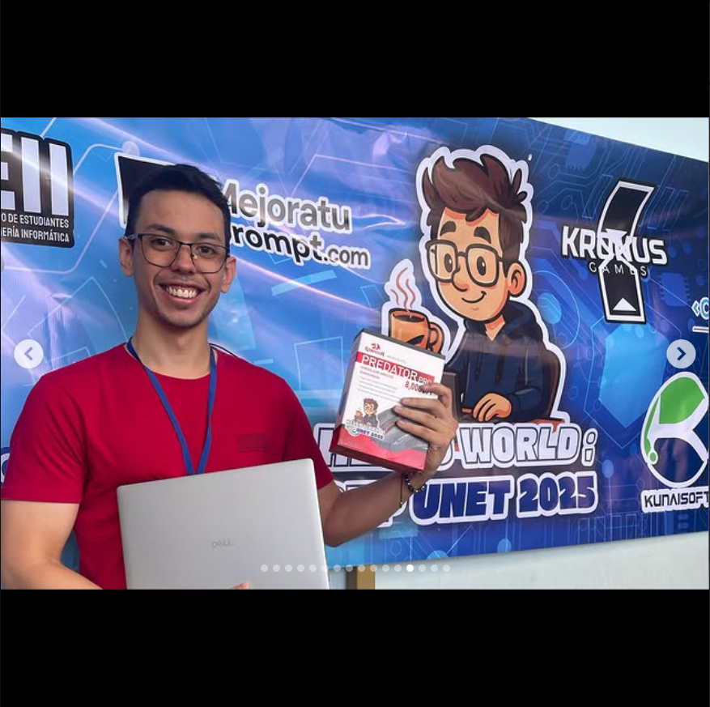
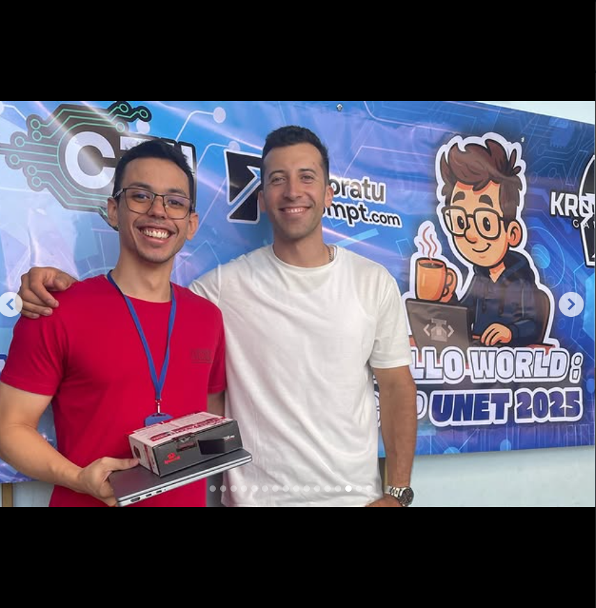

    <h1 align="center">Hola🙋, Mi Nombre es Diego Sánchez. </h1>

# Acerca de mi 🚀

¡Hola! Mi nombre es Diego Sánchez tengo, 25 años y me dedico a la programación web especificamente como desarrollador Full-Stack.

Me gusta enfocarme en pronfundidad a cada proyecto que estoy desempeñando, todo desde una perspectiva analítica y metódica.

## Casa de Estudios 🏢:

Universidad Nacional Experimental del Táchira (UNET).  
Actualmente en 5to Semestre.

## Tecnologías📔:

### En las que me destaco:

 

 
 

### Actualmente aprendiedo en profundidad:

<a href="https://www.typescriptlang.org/" target="_blank" title="Typescript" rel="noreferrer">

 
 

## Competiciones

### Ganador de la <stroke>Hello World Cup 2025 </stroke> 🏆

Categoria MID.

Ha sido uno de mis mayores logros personales y un ejemplo claro para mi que el trabajo duro, un día es recompensado.

 
 

## Redes Sociales

